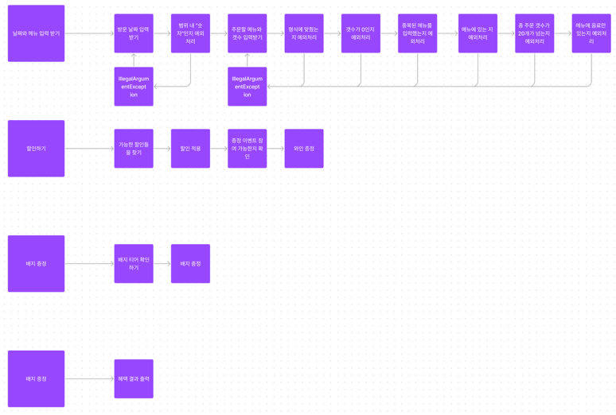

# 기능 목록

## 입력
- [x] 날짜 입력 받는 기능
  - [x] 날짜 입력 문구 출력 기능
  - [x] 입력값이 공백인 지 예외 처리하는 기능
  - [x] 날짜가 숫자인지 예외 처리하는 기능
  - [x] 날짜가 1~31 범위에 있는지 예외 처리하는 기능
  - [x] 예외라면 다시 입력받는 기능
- [x] 주문 메뉴와 갯수 입력받는 기능
  - [x] 주문 메뉴와 갯수 입력 문구 출력 기능
  - [x] 입력값이 공백인 지 예외 처리하는 기능
  - [x] 입력 형식에 맞는 지 예외 처리하는 기능
  - [x] 갯수가 0인지 예외 처리하는 기능
  - [x] 중복된 메뉴가 있는지 예외처리하는 기능
  - [x] 메뉴에 있는지 예외처리하는 기능
  - [x] 총 주문 갯수가 20개를 넘는지 예외처리하는 기능
  - [x] 메뉴에 음료만 있는지 예외처리하는 기능
  - [x] 총 주문 금액이 만원을 넘는지 예외처리하는 기능
  - [ ] 예외라면 다시 입력받는 기능

## 할인 이벤트
- [ ] 크리스마스 디데이 할인 기능
  - [x] 할인이 적용 가능한 지 확인하는 기능 
    - [x] 주문 날짜가 1~25일에 있는지 확인하는 기능
  - [x] 디데이를 계산해서 할인 금액을 계산하는 기능
    - [x] 100원 단위로 추가될 날짜를 계산하는 기능
- [ ] 평일 할인 기능
  - [x] 할인이 적용 가능한 지 확인하는 기능
    - [x] 평일인 지 확인하는 기능
  - [x] 디저트 메뉴 갯수로 할인 금액을 계산하는 기능
    - [x] 주문한 메뉴가 디저트인지 확인하는 기능
- [ ] 주말 할인 기능
  - [x] 할인이 적용 가능한 지 확인하는 기능
    - [x] 주말인 지 확인하는 기능
  - [x] 메인 메뉴 갯수로 할인 금액을 계산하는 기능
    - [x] 주문한 메뉴가 메인 메뉴인지 확인하는 기능
- [ ] 특별 할인 기능
  - [x] 할인이 적용 가능한 지 확인하는 기능
    - [x] 주문 날짜에 별이 있는 지 확인하는 기능 
  - [x] 할인 금액 1000원 적용 기능

## 증정 이벤트
- [ ] 증정 이벤트 기능
  - [x] 총 주문 금액이 12만원 이상인지 확인하는 기능

## 혜택 금액 계산
- [x] 총 금액을 구하는 기능
- [ ] 총 혜택 금액을 구하는 기능
  - [ ] 할인 금액을 구하는 기능
    - [x] 할인 적용 가능한 이벤트들을 구하는 기능
  - [ ] 증정품을 구하는 기능
    - [x] 증정 적용 가능한 이벤트들을 구하는 기능
- [ ] 예상 결제 금액을 구하는 기능
- [ ] 할인 종류와 금액을 카운트하는 기능

## 배지
- [x] 총 혜택 금액에 따라 배지를 고르는 기능

## 출력
- [ ] 시작 문구 출력 기능
- [ ] 혜택 미리보기 문구 출력 기능
- [ ] 혜택 결과 출력 기능
  - [ ] 주문 메뉴 출력 기능
  - [ ] 할인 전 총주문 금액 출력 기능
    - [ ] 3자릿수에서 쉼표로 끊는 기능
  - [ ] 증정 메뉴 출력 기능
  - [ ] 혜택 내역 출력 기능
  - [ ] 총 혜택 금액 출력 기능
    - [ ] 3자릿수에서 쉼표로 끊는 기능
  - [ ] 할인 후 예상 결제 금액 출력 기능
    - [ ] 3자릿수에서 쉼표로 끊는 기능
  - [ ] 12월 이벤트 배지 출력 기능
- [x] 에러 메시지 출력 기능

# 요구 사항 분석
"주문에 대한 혜택의 적용을 보여주는 프로그램"
## 입력
- 방문 날짜
  - 1에서 31 이하 "숫자"만 가능하다
- 주문 메뉴와 개수
  - 주문 메뉴 안에 있는 메뉴만 가능하다
  - 개수는 1개 이상만 가능하다
  - "[메뉴 이름]-[개수]" 형식을 지켜야한다.
  - 중복된 메뉴 입력은 허용하지 않는다.
  - 주문은 음료만 주문할 수 없다.
  - 메뉴는 한 주문에 최대 20개까지 주문할 수 있다.

## 할인
- 할인에는 여러 종류가 있고 겹칠 수 있다.
  - 크리스마스 디데이 할인
    - 2023.12.1 ~ 2023.12.25 안에서만 적용된다.
    - 총금액에서 1000원으로 시작하고 크리스마스에 다가올 수록 100원씩 더 할인된다.
  - 평일 할인
    - 12월에 적용된다.
    - 일 ~ 목요일에만 적용된다. 
    - 총금액에서 "디저트 메뉴" 1개당 2023원 할인
  - 주말 할인
    - 12월에 적용된다.
    - 금, 토요일에만 적용된다.
    - 총금액에서 "메인 메뉴" 1개당 2023원 할인
  - 특별 할인
    - 12월에 적용된다.
    - 요일에 "별"이 있으면 적용된다.
    - 총금액에서 1000원 할인
  - 증정 이벤트
    - "할인 전" 총주문 금액이 12만원 이상이면 적용된다.
    - 샴페인 1개 증정. (혜택 금액에 들어간다.)
- 총 혜택 금액은 "할인 금액의 합 + 증정 메뉴의 가격"이다.
- 할인 후 예상 결재 금액은 "할인 전 총주문 금액 - 할인 금액" 이다.
- 어떤 할인들을 받고 얼마나 할인됬는지 확인 가능해야한다.
- 할인은 총주문 금액(할인 전 금액) 10000원 이상이어야 적용된다.

## 배지
- 총 혜택 금액에 따라 이벤트 배지를 부여한다. (한 주문 당 한 배지)
  - 5000 이상 : 별
  - 10000 이상 : 트리
  - 20000 이상 : 산타

## 출력 
- 주문 메뉴
  - 모든 주문 메뉴를 출력한다. "[주문메뉴] N개" 형식
- 할인 전 총 주문 금액
- 증정 메뉴
  - 없으면 "없음"
- 혜택 내역
  - 각 할인의 종류와 할인된 금액을 출력한다.
  - 없으면 "없음"
- 총 혜택 금액
- 할인 후 예상 결제 금액
- 12월 이벤트 내용
  - 없으면 "없음"

# 실행 흐름도
